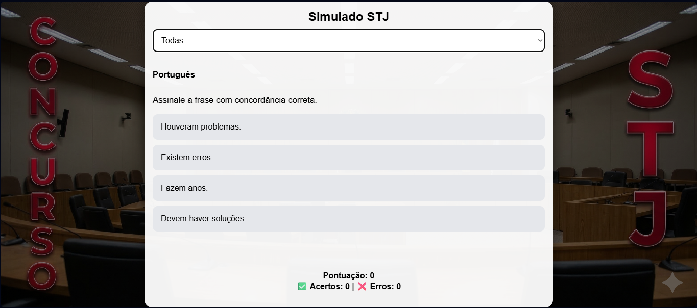

# 🎯 Simulado STJ

Aplicação web interativa para prática de questões de concursos públicos com foco no **STJ (Superior Tribunal de Justiça)**.

O sistema foi desenvolvido com interface moderna, responsiva e com identidade visual baseada no tema **"CONCURSO | STJ"**, com elementos laterais estilizados para melhor imersão.

---

## 🖼️ Interface

A aplicação apresenta:

- Layout responsivo (Mobile, Tablet e Desktop)
- Fundo com imagem temática do STJ
- Elementos visuais laterais com:
  - **CONCURSO (lado esquerdo)**
  - **STJ (lado direito)**
- Interface limpa e focada na leitura

---

## 🧠 Funcionalidades

✔ Simulado com múltiplas questões  
✔ Filtro por matéria  
✔ Correção automática  
✔ Estilo de pontuação tipo **Cebraspe** (+1 / -1)  
✔ Contagem de:
- ✅ Acertos  
- ❌ Erros  

✔ Feedback visual:
- Verde → resposta correta  
- Vermelho → resposta incorreta  

✔ Tela final com desempenho completo  

---

## 📂 Estrutura do Projeto
simulado-stj/
│
├── index.html # Interface principal
├── questoes.json # Banco de questões
├── stj.jpg # Imagem de fundo
└── README.md # Documentação

---

## ⚙️ Tecnologias Utilizadas

- HTML5
- CSS3 (Flexbox + Responsividade)
- JavaScript (Vanilla)

---

## 🎯 Objetivo do Projeto

Este projeto foi desenvolvido com foco em:

- Prática para concursos públicos
- Treino rápido e objetivo
- Simulação de provas reais
- Evolução de habilidades em desenvolvimento web

---

## 🔥 Melhorias Futuras

- 📊 Barra de progresso
- ⏱️ Cronômetro de prova
- 💾 Salvamento de progresso (LocalStorage)
- 🧠 Modo revisão com explicações
- 📱 Transformação em aplicativo (PWA/APK)

---

## 👨‍💻 Autor

Desenvolvido por **Willian Pero Cardoso**

---

## 📌 Observação

Este projeto é educacional e pode ser expandido para uso profissional ou acadêmico.

---

## ⭐ Se gostou do projeto

Deixe uma ⭐ no repositório para apoiar!
   
